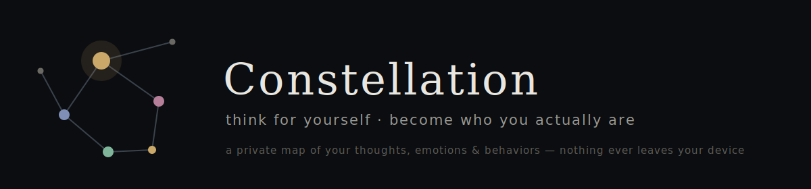

# Constellation

**Try it now → [tyfen2006.github.io/constellation](https://tyfen2006.github.io/constellation/)** — works on any phone or laptop, installs to your home screen like an app.

Constellation is a private mind-mapping tool for your inner life. Instead of journaling in paragraphs, you place **thoughts ◇, emotions ◯, and behaviors △** as points on a dark canvas, connect the ones that feel related, and step back to see the shape your week actually has.

## The idea

Two convictions hold the whole thing together:

1. **Become the best version of yourself.**
2. **To do that, think for yourself.**

Most of what runs through our heads in a day is borrowed — opinions from feeds, fears from comparison, "shoulds" from a crowd we never chose. Constellation is built to push back on that. Every node you place is tagged with an **origin**: *Mine* (I arrived at this myself), *Borrowed* (absorbed from feeds / others / culture), or *Unsure*. Flip on the **Origin lens** and the map lights up to show how much of your inner life you actually authored — a small, honest antidote to social-media groupthink.

## Features

- **The map** — place, drag, and connect nodes; pinch to zoom; multiple maps (one per day, per mood, or per fresh start)
- **Origin lens** — see what's genuinely yours vs. absorbed, at a glance
- **Companion** — a gentle reflective listener that asks open questions so *you* can hear your own mind. It never advises, diagnoses, or concludes anything for you — that would defeat the point
- **Lenses** — examine your situation through six philosophical traditions (Stoic, Existentialist, Absurdist, Buddhist, Aristotelian, Taoist), framed strictly as perspectives to *try on and test*, never beliefs to adopt
- **Fully mobile** — bottom tabs, slide-in menu, peek-and-expand detail sheet, pinch zoom; add it to your home screen and it opens like a native app

Want to see a filled-in example? Download the [demo map](demo-map.json) and use **Import** inside the app.

## Privacy

There is no server, no account, and no analytics. Your maps are saved in your own browser's storage on your own device; companion conversations are never stored at all. Export gives you a backup file that you control. The entire app is one HTML file — you can read every line of what it does.

## Safety

Constellation is a reflection tool, **not** a medical or therapy tool. It doesn't diagnose, treat, or advise, and it isn't a substitute for a qualified professional. If a conversation touches on crisis, the companion stops and points to real help (988 in the US, and international lines via [findahelpline.com](https://findahelpline.com)).

## Tech

Single-file vanilla HTML/CSS/JavaScript — no framework, no build step, no dependencies. Hosted on GitHub Pages. Data persistence via `localStorage`, installable via web app manifest.

## Roadmap

- Patterns view — reflect the week's shape back to the user
- Offline support (service worker)
- A smarter companion (with appropriate clinical review before anything ships)

---

*Built by Tyler Fennelly.*
